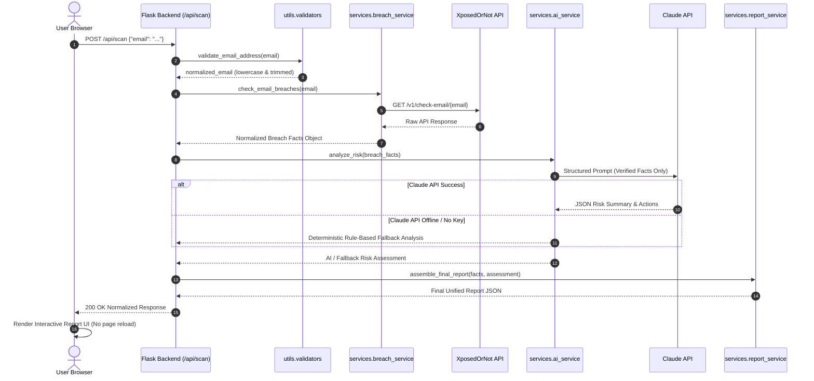

# EchoRisk AI — Project Implementation Notes

## 1. Project Overview & Mission
**EchoRisk AI — Email Data Breach Tracker** is a cybersecurity web application engineered for college students, educators, and everyday users to quickly and privately check whether an email address has been compromised in known security breaches. 

By combining real-time breach intelligence from **XposedOrNot** with AI-driven risk explanation and prioritized defensive advice via **Claude AI**, EchoRisk AI transforms technical breach dumps into clear, actionable, user-friendly security reports.

---

## 2. Architecture & Directory Structure
The application adopts a lightweight, decoupled Flask MVC/Service architecture:

```
Echorisk-AI/
├── 01_PROJECT_PLAN.md
├── 02_UI_DESIGN.md
├── 03_FRONTEND.md
├── 04_FLASK_BACKEND.md
├── 05_BREACH_API.md
├── 06_CLAUDE_AI_AND_REPORT.md
├── 07_TESTING_AND_FINAL_POLISH.md
├── PROJECT_IMPLEMENTATION_NOTES.md
├── README.md
├── VIVA_NOTES.md
├── requirements.txt
├── .gitignore
├── .env
├── app.py
├── run.bat
├── backend/
│   ├── __init__.py
│   ├── app.py
│   ├── requirements.txt
│   ├── ackend/services/
│   │   ├── __init__.py
│   │   ├── breach_service.py
│   │   ├── ai_service.py
│   │   └── report_service.py
│   └── ackend/utils/
│       ├── __init__.py
│       └── validators.py
└── frontend/
    ├── templates/
    │   ├── index.html
    │   └── breach_detail.html
    └── static/
        ├── css/
        │   └── style.css
        ├── js/
        │   └── app.js
        └── assets/
            ├── logo.png
            ├── logo.svg
            └── hero-illustration.svg
```

---

## 3. Flask Endpoints & Responsibilities

| Route | Method | Purpose |
|---|---|---|
| `/` | `GET` | Serves the main landing page UI (`templates/index.html`). |
| `/breach/<path:breach_id>` | `GET` | Serves the dedicated incident dossier page (`templates/breach_detail.html`). |
| `/api/breach/<path:breach_id>` | `GET` | JSON endpoint returning normalized incident data for a specific breach. |
| `/api/scan` | `POST` | Core scan pipeline: validates email, queries XposedOrNot, runs Claude AI / fallback reasoning, and returns the normalized report JSON. |
| `/health` | `GET` | Health monitoring endpoint returning application status, version, and external provider connectivity flags. |

---

## 4. End-to-End Data Flow



---

## 5. Normalized Internal JSON Schemas

### 5.1 Normalized Breach Facts (`breach_service.py`)
```json
{
  "email_masked": "u***r@example.com",
  "breach_count": 2,
  "breaches": [
    {
      "breach_id": "Adobe",
      "breach_title": "Adobe Systems",
      "domain": "adobe.com",
      "breach_date": "2013-10-04",
      "pwn_count": 152445165,
      "description": "In October 2013, 153 million Adobe accounts were breached.",
      "exposed_data": ["Email Addresses", "Password Hints", "Passwords", "Usernames"],
      "reference_url": "https://xposedornot.com/breaches#Adobe"
    }
  ],
  "exposed_data_types": ["Email Addresses", "Password Hints", "Passwords", "Usernames"],
  "has_password_exposure": true,
  "source": "XposedOrNot",
  "status": "success"
}
```

### 5.2 Final Combined Report Response (`/api/scan`)
```json
{
  "status": "success",
  "timestamp": "2026-09-26T22:30:00Z",
  "email_masked": "u***r@example.com",
  "summary": {
    "breach_count": 2,
    "has_breaches": true,
    "risk_level": "High",
    "risk_score": 75,
    "has_password_exposure": true,
    "exposed_data_types": ["Email Addresses", "Passwords", "Usernames"]
  },
  "ai_analysis": {
    "risk_level": "High",
    "short_summary": "Your credentials were leaked in multiple high-volume breaches including plaintext or hashed passwords.",
    "key_findings": [
      "Password exposure confirmed in 1 breach",
      "Account credentials have been exposed on public paste/breach platforms"
    ],
    "recommended_actions": [
      "Change passwords immediately on all accounts using this password",
      "Enable Multi-Factor Authentication (MFA/2FA)",
      "Use a password manager to generate unique passwords"
    ],
    "disclaimer": "This assessment is based exclusively on verified records in the XposedOrNot database.",
    "ai_powered": true
  },
  "breaches": [ ... ],
  "attribution": {
    "provider": "XposedOrNot",
    "url": "https://xposedornot.com"
  }
}
```

---

## 6. Environment Variables (`.env`)

| Variable | Description | Default / Example |
|---|---|---|
| `FLASK_ENV` | Environment mode (`development` or `production`) | `development` |
| `FLASK_PORT` | HTTP port for server | `5000` |
| `SECRET_KEY` | Flask session secret key | `echorisk-dev-secret-key-change-in-prod` |
| `ANTHROPIC_API_KEY` | Optional API key for Claude AI analysis | `sk-ant-...` (falls back to deterministic engine if blank) |
| `ANTHROPIC_MODEL` | Claude model identifier | `claude-3-5-sonnet-20241022` |
| `MOCK_MODE` | Enable offline mock data for demonstrations | `false` |

---

## 7. Error Handling & Edge Cases
1. **Invalid or Malformed Email**:
   - Backend returns `400 Bad Request` with `{"status": "error", "code": "INVALID_EMAIL", "message": "Please enter a valid email address."}`.
2. **No Breaches Found**:
   - Backend returns `200 OK` with `breach_count: 0`, `risk_level: "Low"`, stating clearly: "No matching breaches found in checked databases."
3. **Breach Provider Unreachable / Rate Limited**:
   - Backend gracefully catches connection errors, returns `503 Service Unavailable` with friendly feedback and option to retry or toggle mock mode.
4. **Claude AI API Timeout or Missing Key**:
   - Seamless deterministic fallback engine takes over; users still receive verified breach stats and rule-based cybersecurity recommendations.
5. **Zero Data Retention**:
   - Scanned email addresses are processed in volatile memory only and never written to logs or persistent storage.
