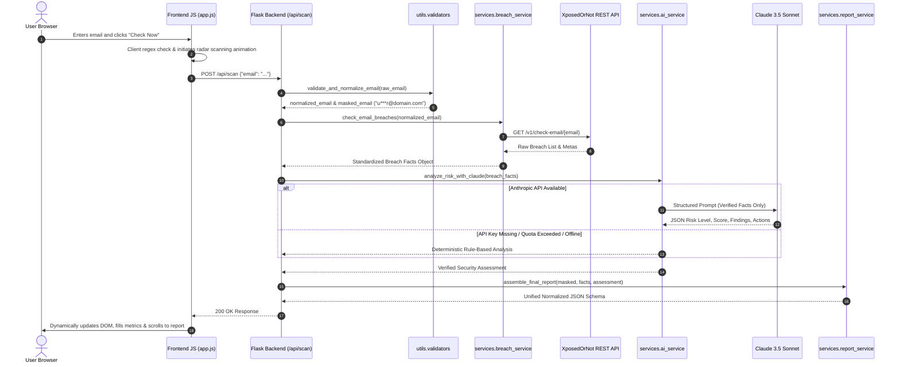

# EchoRisk AI — Comprehensive Viva Notes & Technical Guide (Part 2)

This document serves as an exhaustive, in-depth technical reference and viva preparation guide for **EchoRisk AI — Email Data Breach Tracker**. It details the architecture, component-by-component language choices, deep-dive animation and UX engineering, cryptographic privacy mechanisms, and model answers for academic examiners.

---

## Table of Contents
1. [Project Overview & Elevator Pitch](#1-project-overview--elevator-pitch)
2. [Technology Stack & Language Breakdown](#2-technology-stack--language-breakdown)
3. [End-to-End System Architecture & Data Flow](#3-end-to-end-system-architecture--data-flow)
4. [Animation Concepts & UI/UX Engineering](#4-animation-concepts--uiux-engineering)
5. [Privacy, Security & Cryptographic Mechanisms](#5-privacy-security--cryptographic-mechanisms)
6. [AI Integration & Anti-Hallucination Pipeline](#6-ai-integration--anti-hallucination-pipeline)
7. [Comprehensive Viva Questions & Model Answers](#7-comprehensive-viva-questions--model-answers)
8. [Examiner Live Demonstration Walkthrough Checklist](#8-examiner-live-demonstration-walkthrough-checklist)

---

## 1. Project Overview & Elevator Pitch

### What is EchoRisk AI?
**EchoRisk AI** is a privacy-first cybersecurity web application that checks whether a user's email address or password has been compromised in verified third-party data breaches. 

Raw breach dumps and hacker pastebins present cryptic, fragmented information (such as password hash algorithms, salt parameters, or leaked SQL columns) that everyday users cannot interpret. EchoRisk AI solves this by pairing real-time breach threat intelligence from **XposedOrNot** with defensive AI reasoning (via **Anthropic Claude 3.5 Sonnet**) and an internal **Deterministic Rule Engine** to produce:
1. An objective **Threat Index** (0–100 score).
2. A transparent **Risk Level** (Low, Moderate, High, Critical).
3. Plain-language **Key Observations** regarding leaked information types.
4. Prioritized, step-by-step **Defensive Countermeasures** (e.g., credential rotation, MFA adoption, session revocation).

### Core Architectural Philosophy
- **Privacy by Design:** Zero persistent storage. Scanned emails and audited passwords are never written to disk, database tables, or server access logs.
- **Anti-Hallucination Grounding:** Verified breach records are collected first. The AI model is strictly constrained to analyzing verified facts—it never retrieves or invents breach incidents.
- **Client-Side k-Anonymity:** Passwords are never sent over the network in plaintext. Browser-side **Keccak-512** hashing ensures only a 10-character hash prefix is transmitted.

---

## 2. Technology Stack & Language Breakdown

EchoRisk AI avoids heavy full-stack frameworks in favor of a clean, decoupled **Python Flask + Vanilla Modern Web Standards** architecture:

```
Echorisk-AI/
├── backend/
│   ├── app.py                     # Flask API server & route handlers
│   ├── services/
│   │   ├── breach_service.py       # XposedOrNot REST client & normalizer
│   │   ├── ai_service.py           # Claude AI SDK & Fallback Rule Engine
│   │   └── report_service.py       # JSON report aggregator
│   └── utils/
│       └── validators.py          # Email regex, Levenshtein typo suggestion, DNS check
├── frontend/
│   ├── templates/
│   │   ├── index.html              # Main single-page application landing page
│   │   └── breach_detail.html      # Server-rendered individual incident dossier
│   └── static/
│       ├── css/
│       │   └── style.css           # Custom design system & keyframe animations
│       └── js/
│           └── app.js              # Client state, async fetch, crypto & DOM logic
```

### Detailed Component Justifications

| Component | Technology | Why Chosen & Viva Defense |
|---|---|---|
| **Backend API Gateway** | **Python 3 (Flask)** | **Lightweight Micro-Framework:** Unlike Django, Flask has zero boilerplate or mandatory database layers. It acts as a lightning-fast API gateway connecting HTTP clients to AI models and threat intelligence APIs. Python's rich ecosystem allows native integration with `anthropic`, `requests`, and standard socket networking. |
| **Input Sanitization & Validation** | **Python standard libraries** (`re`, `socket`) | **Multi-Stage Defense:** Validates RFC-compliant email structure, uses **Levenshtein distance** to catch mistyped popular domains (e.g., `gamil.com` $\to$ `gmail.com`), performs non-blocking DNS MX resolution, and masks targets (`u***r@domain.com`) for log hygiene. |
| **Threat Intelligence Service** | **Python** (`requests`) | Queries the **XposedOrNot REST API** over TLS/HTTPS (`/v1/check-email/{email}`). Normalizes unstructured breach lists into a consistent internal JSON schema containing breach titles, logos, domains, leaked fields, and pwn counts. |
| **AI Reasoning & Fallback** | **Python** (`anthropic` SDK) | Uses **Claude 3.5 Sonnet** (`claude-3-5-sonnet-20241022`) with low temperature ($0.2$) and strict system prompts. Includes an internal **Deterministic Rule Engine** that automatically takes over if the external AI API is rate-limited or unconfigured. |
| **Frontend UI Structure** | **HTML5 (Semantic)** | Fully semantic elements (`<header>`, `<main>`, `<section>`, `<nav>`, `<article>`, `<dialog>`) with rich ARIA roles (`role="alert"`, `aria-live="polite"`, `aria-busy="true"`) for accessibility. |
| **Frontend Styling & Visuals** | **Vanilla CSS3** | Custom design system using CSS Custom Properties (variables), CSS Grid, Flexbox, media queries for 100% responsiveness, and a print stylesheet (`@media print`). **Zero Tailwind or Bootstrap bloat.** |
| **Frontend Client Logic** | **Vanilla JavaScript (ES6+)** | Uses native `fetch()`, `async/await`, DOM manipulation, and smooth scrolling without the overhead of heavy virtual-DOM libraries like React or Angular. |
| **Client-Side Cryptography** | **JavaScript** (`js-sha3` + Pure JS Keccak-512 fallback) | Calculates cryptographic hashes in the browser to enable **k-anonymity** password checking. |
| **Server-Side Templating** | **Jinja2** | Dynamically serves SEO-friendly incident dossiers (`/breach/<breach_id>`) directly from Flask. |

---

## 3. End-to-End System Architecture & Data Flow

### Sequence Diagram of an Email Audit



---

## 4. Animation Concepts & UI/UX Engineering

One of the standout features of EchoRisk AI is its modern, state-of-the-art visual presentation. All animations are engineered using **pure CSS3 and vanilla JavaScript** without third-party animation libraries (like GSAP, Anime.js, or Lottie).

### A. CSS Keyframe Animations (`@keyframes`)

| Keyframe Rule | CSS Selector | Description & Visual Concept |
|---|---|---|
| `@keyframes radar-wave` | `.pulse-ring.ring-1`, `.ring-2` | **Sonar / Radar Scanner Wave:** Emulates an active cybersecurity radar. Two concentric circular borders scale outward from `scale(0.6)` to `scale(1.6)` while animating opacity from `0.8` down to `0`. A `0.6s` animation delay on the second ring creates a realistic continuous pulse wave. |
| `@keyframes heroLevitate` | `.hero-illustration-img` | **Smooth Physics Levitation:** Floats the cybersecurity shield graphic gently along the Y-axis (`translateY(-12px)` and subtle rotation of `1.2deg`). Configured with `cubic-bezier(0.45, 0.05, 0.55, 0.95)` over `4.2s` for a natural, anti-gravity floating feel. |
| `@keyframes heroAuraBreath` | `.bg-glow` | **Ambient Breathing Glow:** Slowly pulses radial gradient purple backdrops behind the hero section (`scale(1.0)` to `scale(1.12)`, opacity `0.4` to `0.75`), giving the interface an organic, living atmosphere. |
| `@keyframes terminalShake` | `.terminal-window.error-state` | **Negative Feedback Terminal Shake:** When invalid input is submitted, the terminal window oscillates horizontally (`translateX(-8px)` $\to$ `translateX(8px)` $\to$ `0`) over `0.3s`, inspired by macOS password denial animations. |
| `@keyframes bellWobble` | `.btn-notify.ringing` | **Damped Harmonic Bell Ring:** Oscillates the notification bell icon between `-18deg` and `+14deg` with rapid damping, simulating a physical bell chime when clicked. |
| `@keyframes pulse-dot` | `.badge-dot`, `.terminal-status-dot` | **Live Status Pulse:** Green indicator dots continuously pulse with expanding box-shadow rings (`box-shadow: 0 0 0 4px rgba(34, 197, 94, 0)`), signaling active background connections. |
| `@keyframes spin` | `.btn-spinner`, `.btn-audit-spinner` | **Linear High-Speed Spinner:** Standard 360-degree rotation indicating background HTTP operations. |
| `@keyframes popInModal` | `.modal-card` | **Spring-Physics Modal Entry:** Scales the modal from `0.92` to `1.0` and translates from `-16px` to `0` using `cubic-bezier(0.16, 1, 0.3, 1)` for an app-like pop. |
| `@keyframes fadeInModal` | `.modal-backdrop` | **Smooth Backdrop Dim:** Fades the darkened overlay in over `0.2s`. |
| `@keyframes slideToast` | `.toast` | **Bottom-Up Slide Toast:** Notifications slide upwards from `translateY(20px)` while fading in. |
| `@keyframes navPillLine` | `.nav-link.active::after` | **Underline Expansion:** Expands the active purple indicator underline from `width: 0%` to `width: 100%` when a navigation tab is selected. |

---

### B. Micro-Interactions & JavaScript State Transitions

1. **Simulated Multi-Step Progress Tracker:**
   - In `app.js`, a JavaScript interval coordinates UI text during scanning:
     * Step 1 (0ms): *"Querying XposedOrNot threat intelligence repository..."* (Progress: 30%)
     * Step 2 (450ms): *"Cross-referencing known data breaches & pastes..."* (Progress: 65%)
     * Step 3 (900ms): *"Analyzing exposure vectors with EchoRisk AI reasoning..."* (Progress: 90%)
   - Smoothly transitions using `transition: width 0.4s cubic-bezier(0.4, 0, 0.2, 1)`.

2. **Real-Time Password Entropy & Dynamic Bar Animation:**
   - As the user types into the Password Auditor, an entropy equation evaluates the character pool:
     $$\text{Pool Size} = \text{Lower}(26) + \text{Upper}(26) + \text{Digits}(10) + \text{Symbols}(33)$$
     $$\text{Entropy Score} = \text{Length} \times \frac{\log(\text{Pool Size})}{\ln(2)}$$
   - The strength bar width and color class transition smoothly across 5 tiers:
     * Very Weak ($<25$, Red, width 20%)
     * Weak ($<40$, Orange, width 40%)
     * Fair ($<60$, Amber, width 65%)
     * Strong ($<78$, Green, width 85%)
     * Cryptographic ($\ge 78$, Purple, width 100%)

3. **Interactive Pill Navigation & ScrollSpy:**
   - The navigation bar uses a pill design with `transition: all 0.22s cubic-bezier(0.4, 0, 0.2, 1)`.
   - On hover, pills lift with `translateY(-1.5px)` and illuminate with a soft drop-shadow.
   - A passive scroll listener calculates section offsets and updates the active tab smoothly.

4. **Print Optimization (`@media print`):**
   - Strips out background glows, navigation bars, and inputs.
   - Injects a formal print-only header with timestamps and formats the audit report into a printable dossier.

---

## 5. Privacy, Security & Cryptographic Mechanisms

### 1. Zero Permanent Data Retention
- Scanned emails are never persisted in databases, SQLite files, or session stores.
- Processing takes place exclusively in volatile RAM.
- Logging masks target emails (`o***l@gmail.com`) so plain addresses never appear in server logs.

### 2. Password Exposure Checking via k-Anonymity
A major highlight for viva examiners is explaining how passwords can be safely checked without transmitting them to the server:

```
[ Plaintext Password: "MySecretPassword123" ]
                  │
                  ▼ (Client-side in browser JS)
     Compute Keccak-512 Hash
                  │
                  ▼
[ Full Hash: "3c8a9e7f12b04c81d392... (128 hex chars)" ]
                  │
                  ▼ (Extract first 10 hex characters)
[ Hash Prefix: "3c8a9e7f12" ]
                  │
                  ▼ (Send over HTTPS)
     GET https://passwords.xposedornot.com/api/v1/pass/anon/3c8a9e7f12
                  │
                  ▼
[ Response: HTTP 200 (Found) or HTTP 404 (Not Found) ]
```

**Viva Justification:**  
Because only a **10-character hash prefix** is transmitted, it is cryptographically impossible for an eavesdropper, proxy, or external API server to reverse the prefix back to the original plaintext password. The full password **never leaves the client's browser**.

### 3. Levenshtein Distance Typo Correction
In `backend/utils/validators.py`, when a user types an uncommon or misspelled domain (e.g., `user@gamil.com`), the backend computes the edit distance against a list of known email providers (`gmail.com`, `yahoo.com`, `outlook.com`, `proton.me`). If the edit distance is $\le 2$, the API returns a suggestion button: *"Did you mean test@gmail.com?"*, which the user can accept with a single click.

---

## 6. AI Integration & Anti-Hallucination Pipeline

### Why Query the Breach Database Before AI?
**Crucial Viva Point:**  
Large Language Models (LLMs) are generative probabilistic models. If asked directly: *"Was user@example.com breached?"*, an LLM will extrapolate or hallucinate fake breach dates, non-existent database names, and fabricated passwords.

To solve this, EchoRisk AI uses a **two-phase pipeline**:
1. **Fact Retrieval Phase:** Queries the authoritative XposedOrNot threat intelligence repository to retrieve 100% verified ground truth facts.
2. **AI Reasoning Phase:** Injects only the verified facts into Claude AI with the following system constraints:
   - Reason **only** over provided facts.
   - Do **not** hallucinate or invent new breaches.
   - Do **not** output raw passwords or attack instructions.
   - Return strictly structured JSON matching the internal schema.

### Deterministic Rule Engine (Graceful Degradation)
If the Claude API key is absent, network connectivity drops, or Anthropic experiences an outage, `backend/services/ai_service.py` executes an internal deterministic algorithm:
- Base score: $30$ points.
- Incremental risk: $+\min(\text{Breach Count} \times 15, 45)$ points.
- Password penalty: $+25$ points if passwords were exposed.
- Risk levels mapped mathematically: Low ($<30$), Moderate ($30-69$), High ($70-84$), Critical ($\ge 85$).
- Selects context-aware mitigation actions tailored to exposed fields.

---

## 7. Comprehensive Viva Questions & Model Answers

### Q1: What inspired EchoRisk AI and what specific problem does it solve?
**Answer:**  
*"Billions of user credentials circulate on the dark web as a result of third-party breaches. Non-technical users often struggle to interpret technical breach logs and don't know what concrete actions to take. EchoRisk AI solves this by bridging the gap between raw threat intelligence and end users, providing plain-language risk evaluations and actionable defensive guidance while respecting user privacy."*

---

### Q2: Why did you build the frontend with Vanilla HTML/CSS/JS rather than React or Next.js?
**Answer:**  
*"Three main reasons:  
1. **Performance & Footprint:** Vanilla technologies require zero compilation steps, no node build pipeline, and no virtual-DOM overhead, delivering instant page loads.  
2. **Maintenance & Longevity:** Native web standards run reliably across all modern browsers without package dependency vulnerabilities.  
3. **Viva Explainability:** It allows us to demonstrate deep foundational knowledge of DOM APIs, CSS keyframe mathematics, and the asynchronous Fetch API rather than relying on framework abstractions."*

---

### Q3: What is XposedOrNot and why choose it over HaveIBeenPwned?
**Answer:**  
*"HaveIBeenPwned requires a paid commercial API key with strict rate-limiting for automated email checking. XposedOrNot is an open, community-supported cybersecurity intelligence repository that provides a fully featured, transparent REST API with rich metadata (including domain tags, breached fields, logos, and pwn counts), making it ideal for educational and privacy-focused tools."*

---

### Q4: How does the Password Exposure Checker protect user credentials?
**Answer:**  
*"Through **k-anonymity** using browser-side **Keccak-512** hashing. When a password is typed, JavaScript generates the hash locally and sends only the first 10 hex characters to the API. Because a 10-character prefix cannot be mathematically reversed to recover the password, the user's password never leaves their machine in plaintext."*

---

### Q5: How do you prevent Large Language Model hallucinations?
**Answer:**  
*"We decouple data retrieval from reasoning. The breach database is queried first to gather verified facts. Claude AI is then given a strict prompt forbidding speculation and is used solely for defensive reasoning, risk scoring, and translation into plain language. If the AI is unavailable, our internal rule-based engine takes over automatically."*

---

### Q6: Why is there no user database or authentication in the application?
**Answer:**  
*"Privacy by design. A service auditing credential breaches should not itself store email addresses or passwords. Creating a user database would establish a honeypot that could become a target for attackers. By processing requests strictly in volatile RAM, EchoRisk AI eliminates this attack surface entirely."*

---

### Q7: What animation techniques did you use on the frontend?
**Answer:**  
*"We implemented pure CSS3 keyframe animations and transitions:  
- `@keyframes radar-wave` for the pulsing sonar radar during scanning.  
- `@keyframes heroLevitate` with custom cubic-bezier timing for the floating shield.  
- `@keyframes terminalShake` for negative input feedback.  
- Smooth width transitions for the dynamic scan progress bar and password entropy meter.  
All animations are hardware-accelerated via `transform` and `opacity` to maintain 60 FPS without external JavaScript animation libraries."*

---

### Q8: What error handling is implemented across the stack?
**Answer:**  
*"The app implements defense-in-depth error handling:  
- **Client-Side:** Real-time email regex validation and interactive typo suggestions.  
- **Backend Validation:** Catches malformed inputs, unreachable domains, and returns standard HTTP status codes (`400`, `500`, `503`).  
- **Service Resilience:** Network timeouts are handled gracefully. If XposedOrNot or Claude fails, user-friendly error banners or the rule-based fallback engine are displayed rather than exposing stack traces."*

---

## 8. Examiner Live Demonstration Walkthrough Checklist

During your live project demonstration, follow this smooth 6-step script:

1. **Landing Page Tour:**  
   - Point out the clean purple/white cybersecurity design system, the floating hero illustration (`heroLevitate`), and the pulsing "API Ready" status indicator.
2. **Breached Demo Scan:**  
   - Click the **"Breached Demo"** chip (`compromised@example.com`).
   - Draw attention to the **Radar pulse animation** and multi-step progress bar.
   - Highlight the generated report: Threat Score ($/100$), Risk Badge, Key Findings, Exposed Categories chips, individual breach cards, and the Defensive Actions checklist.
3. **Clean Demo Scan:**  
   - Click **"Scan Another Email"** and select the **"Safe Demo"** chip (`safe@example.com`).
   - Show how the UI dynamically adapts to display a clean status banner with positive cyber-hygiene guidance.
4. **Input Validation & Typo Detection:**  
   - Enter `test@gamil.com` in the input field.
   - Show the **Terminal Shake animation** and the automatic suggestion: *"Did you mean test@gmail.com?"*.
5. **Password Auditor (k-Anonymity):**  
   - Scroll down to the Password section.
   - Type a sample password to demonstrate real-time entropy calculation and color transitions.
   - Click **"Check"** to demonstrate client-side Keccak-512 prefix hashing.
6. **Print / Export Feature:**  
   - Click **"Print Report"** to show the print-optimized CSS stylesheet that formats the results into an ink-friendly security dossier.
